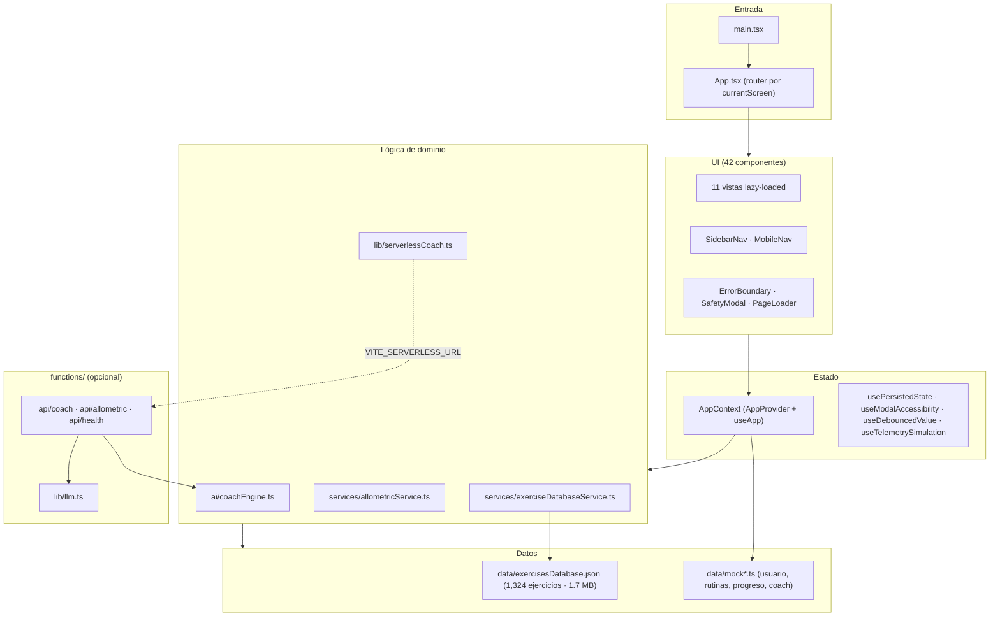

# FitAI — Análisis de Arquitectura

## Grafo de dependencias (capas)

## Resumen

- **Arquitectura**: SPA sin router real; navegación por `currentScreen` en contexto global. Flujo: Landing/Auth → Onboarding → Layout (Sidebar + vistas lazy).
- **Estado central** (`AppContext.tsx` · 668 ln): God object con 7 responsabilidades (auth, nav, workout, chat, rutinas, historial, persistencia). Candidato principal a descomposición.
- **Capa científica** (`allometricService.ts` · 413 ln): motor alométrico (Kleiber M^3/4, cardíaca M^-1/4, fuerza M^2/3). Diferenciador de la app.
- **Dataset** (`exercisesDatabase.json` · 1.7 MB): 78% del build dist. Importado eagerly por `DashboardView`. Candidato a externalización CDN.
- **Serverless** (`functions/`): opcional, 0 consumo sin configurar. Coach con fallback local → serverless → LLM.